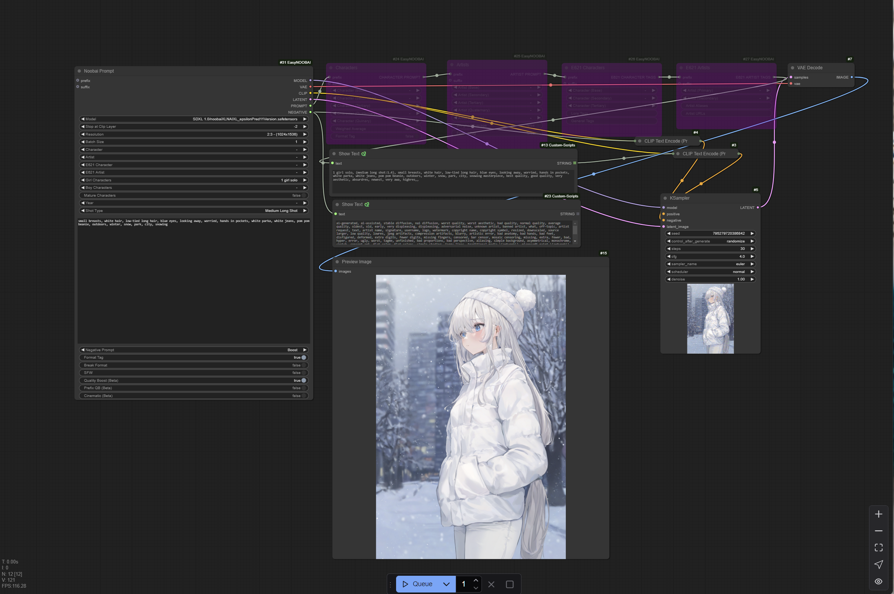

# ComfyUI EasyNoobAI

> [!WARNING]
> All of the list used in this node are very large and can take a long time to generate. Please be patient when using this node. I am currently limited this to about 0.025% of the total list size which is equal to about 5000-6000 entries
> If dont see your favor character or artist, you can recompile the list with the script I have provided in the assets folder. You can create a new characters list by running `py noobai-list-convert.py -i danbooru_character_webui.csv -o characters.py -n CHARACTERS -t 0.05 -d` as
> and example. This will give you a file called `characters.py` which will need to be moved to the src folder...and comfyui restarted. You will need to use the flag `-n [NAME]` on all the files and you will need to match naming conventions that are being looked for in the
> scripts. for `-n CHARACTERS -o characters.py` or `-n ARTISTS -o artists.py` or `-n E621_CHARACTERS -p e62_characters.py`. you should back up all files before replacing them. Know that you will need to `stash` your changes before you can pull and update for the node

> [!NOTE]
> I am not a prolific user of `NOOBAI XL / Illustrious` models; This node was created to help simplify the complex and sometimes confusing process of prompting with `NOOBAI XL / Illustrious` models.
> It is based on the implementation of different articles, model documentation, and images created with said models. This means I may not have hit the mark with the implementation of the node, 
> but I have tried to make it as user-friendly as possible. If you have any suggestions or improvements, please feel free to reach out to me on the ComfyUI Discord server.

EasyNoobAI - Resources for implementation of EasyPony prompt sturcture
- [prompting-for-score-or-source-or-rating-or-and-an-overview-of-prompting-syntax](https://civitai.com/articles/8962)
- [NoobAI-XL - Epsilon-pred 0.75 - Visual Tag Reference](https://civitai.com/articles/8510/noobai-xl-epsilon-pred-075-visual-tag-reference)
- [F****** BEST NEGATIVE PROMPT FOR NOOBAI-XL](https://civitai.com/articles/9695/f-best-negative-prompt-for-noobai-xl)

## TOOLS
The lists for the characters and artists are based on the tags from Danbooru and E621. Are massive, so I am currently limiting it to about 0.12% of the top tags. This is roughly about 5000-6000 entries for each list. If you find it to be too large or small, you can use the `noobai-list-convert.py` in the assets folder to convert the list to a smaller or larger list. This is a CLI and needs to be in the same folder as the csv files.
You need to run these under a environment that has inquirer, tqdm, and colorama installed. You can install these by running `pip install inquirer tqdm colorama` in the terminal under a python environment.

## NoobAI Prompt (Main Node)
* `Model`: Lets you select the model you want to use. Use only NoobAI or Illustrious models.
* `Stop at Clip Layer`: Stops the generation at the clip layer. Most models use -2.
* `Resolution`: The resolution of the generated image. The higher the resolution, the better the quality of the image.
* `Batch Size`: The number of images generated per prompt. The higher the batch size, the more images generated.
* `Character`: The character you want to generate based on Danbooru tags.
* `Artist`: The artist you want to generate based on Danbooru tags.
* `E621 Character`: The character you want to generate based on E621 tags.
* `E621 Artist`: The artist you want to generate based on E621 tags.
* `Girl Chraracter`: Will insert [x] girl/s into the prompt.
* `Boy Character`: Will insert [x] boy/s into the prompt.
* `Mature Character`: Will change tags girl/s // boys/s to to Woman/Man...etc (Experimental, not sure this matters).
* `Year`: The year you want to generate based on Danbooru tags.
* `Shot Type`: The type of framing you want
* `Prompt`: Open prompt, {prefix} {character} {action} {artist} {shot type} {prompt} {suffix}
* `Negative Prompt`: Template Negative Prompt based on the article [F****** BEST NEGATIVE PROMPT FOR NOOBAI-XL](https://civitai.com/articles/9695/f-best-negative-prompt-for-noobai-xl)
* `Format Tag`: Format Character and Artist tags to be used in the prompt.
* `SFW`: Will add SFW tag to the prompt.
* `Quality Boost`: Will add `"masterpiece, best quality, good quality, very aesthetic, absurdres, newest, very awa, highres,"` to the prompt.
* `Prefix QB`: Will prefix the Quality Boost tag to the prompt.
* `Cinematic`: Will add `"(scenery, volumetric lighting)"` to the prompt.
* 
## Usage

Character/Artist (Overload Nodes)

These nodes are used to add multiple characters and artists to the prompt based on the tags from Danbooru and E621. The tags are separated by a comma.
You are limited to 5 characters and 5 artists per prompt, but you can always add more by chaining the nodes.

### Install from ComfyUI Manager

- Type `EasyNoobAI` on the search bar of [ComfyUI Manager](https://github.com/ltdrdata/ComfyUI-Manager).
- Click the install button.

### Manual Installation

To install `ComfyUI-EasyNoobAI`:

1. Open the terminal in the ComfyUI `custom_nodes` folder.
2. Run: `git clone https://github.com/itsjustregi/ComfyUI-EasyNoobAI`.
3. Restart ComfyUI.

### Update

To update `ComfyUI-EasyNoobAI`:

1. Open the terminal in the `ComfyUI-EasyNoobAI` folder.
2. Run: `git pull`.
3. Restart ComfyUI.

Parameters with null value (-) will not be included in the generated prompt.

## Practical Advice

ComfyUI-EasyNoobAI is a helper node that simplifies the process of adding scoring and other attributes to the core when prompting with `NOOBAI XL / Illustrious` models.
Model selection determines the quality of the images from the prompt. The effectiveness of the parameters depends on the quality of the checkpoint used.

## License

This project is licensed under the MIT License.
